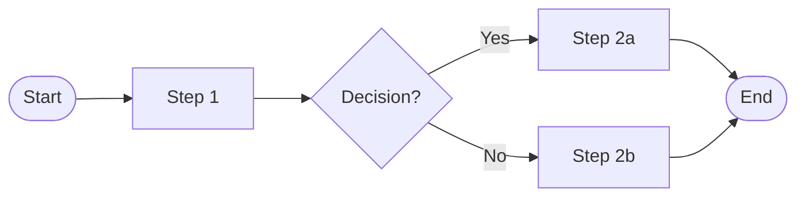

# Diagram sources (Mermaid)

This blog has no Mermaid integration. Render these to SVG (hand-author
or via `mmdc`) and drop the SVGs into this directory before the lift.
See `README.md` in this dir for the palette to match.

---

## 1. Diagram name

What this diagram shows in one line.

---

## 2. Another diagram

…
