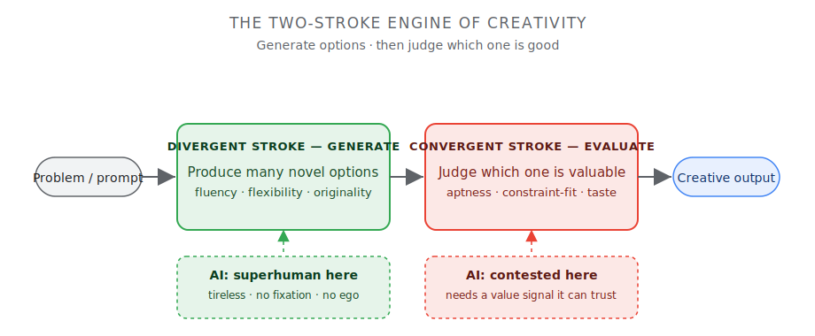
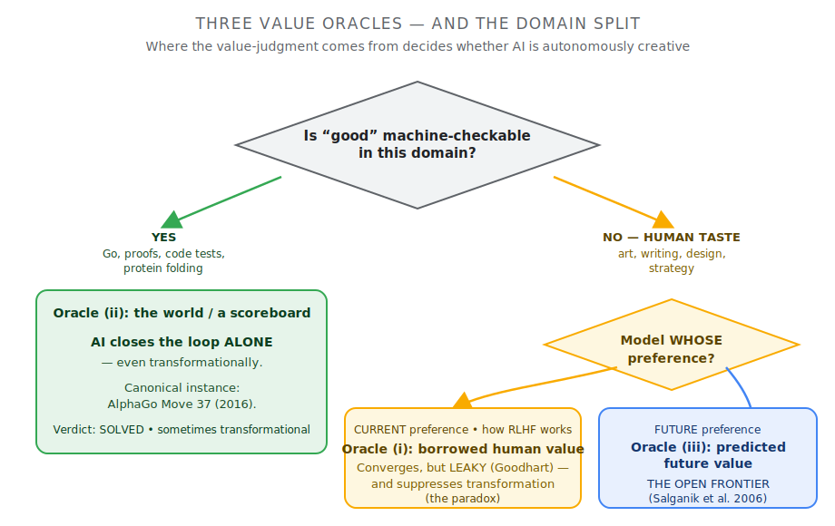
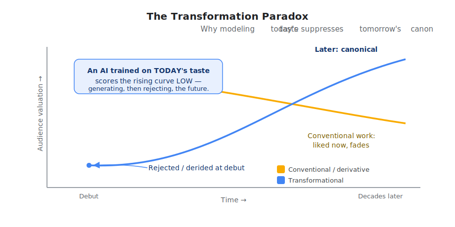

> **Companion to:** [*Ideas Are Cheap Now*](/blog/ideas-are-cheap)
> — the short essay version of this argument.
>
> **Download:** [PDF version](/posts-media/creativity-and-machines.pdf)
> (typeset for offline / archival reading).

**Abstract.** The debate over machine creativity is stalled because its
central question is malformed. Drawing on the standard definition of
creativity as the conjunction of novelty and value, we argue that
contemporary AI has made novelty abundant while leaving value-judgment
scarce, and that the entire dispute is therefore better posed as a
question about value: who or what supplies it. We distinguish three
"value oracles" — modeled current preference, post-hoc real-world
selection, and predicted future preference — and show that AI's
creative capability is sharply domain-dependent. Where value is
machine-checkable, AI already exhibits autonomous, occasionally
transformational creativity; where value is human and contested, AI
converges only by borrowing a leaky proxy of human judgment; and the
prediction of future taste remains empirically unsolved. We engage the
two strongest objections — the interpolation ("stochastic parrots")
critique and the symbol-grounding / no-stakes critique — and conclude
that neither defeats everyday machine creativity, though the latter
marks the genuine open frontier. *This is a position paper: a
synthesis of existing literature, not a new empirical result.*

## 1. The malformed question

"Can AI be creative?" has been debated for as long as there has been
AI, and the debate has the texture of a question that is being asked
badly. One camp insists that large language models merely interpolate
over their training data and so cannot be creative in any meaningful
sense; the other points to fluent, surprising, useful outputs and calls
the first camp's standard a romantic superstition. Both sides are
partly right, which is usually a sign that the word at the center is
doing too much work.

This paper makes a single structural claim: **the question dissolves
once "creativity" is decomposed into its two standard components,
because modern AI has transformed one of them and barely touched the
other.** The component it has transformed — novelty — is the one the
folk debate fixates on. The component it has barely touched — value —
is the one that actually determines whether a machine can be creative,
and the answer to *that* question is not yes or no but *it depends on
the domain*, in a way we can make precise.

## 2. Creativity is novelty × value

The most cited definition in the field is bipartite. Stein (1953) first
stated it cleanly; Runco & Jaeger (2012) codified it as "the standard
definition": a product is creative if and only if it is both *original*
and *effective* (novel and valuable). Originality is necessary but not
sufficient — "original things must be effective to be creative" [1, 2].
Simonton later argued for a third criterion, *surprise*, and formalized
creativity as a *multiplicative* function, c = (1 − p)·u·(1 − v), of
improbability, utility, and non-obviousness [3]. The multiplicative
form is worth dwelling on: it means a zero on *either* novelty *or*
value yields zero creativity. The two factors are not additive
contributions to a sum; they gate each other.

Boden's taxonomy [4] supplies the standard scaffolding for the
*novelty* factor. She distinguishes **combinational** creativity (novel
combinations of familiar ideas), **exploratory** creativity (new points
within an existing conceptual space), and **transformational**
creativity (changing the rules of the space itself); orthogonally, she
separates **P-creativity** (novel to the person) from **H-creativity**
(novel in all of history). Crucially, Wiggins (2006) [5] formalized
this picture into a "Creative Systems Framework" in which a conceptual
space, traversal rules, and — decisively — an *evaluation function E*
are made explicit. In Wiggins's formalism, a novel or out-of-space
concept counts as creative *only if E rates it valuable*.
Value-judgment is thus not a vague humanistic add-on; it is a
separable, first-class component of any formal account of creativity.
This is the linchpin of everything that follows.

## 3. Novelty is now abundant

Two empirical literatures, taken together, undercut the premise that
genuine novelty is rare and precious and therefore a plausible moat
against machines.

First, **most human innovation is itself recombination.** Across 220
years of U.S. patents, 77% are coded as combinations of two or more
existing technology classes, and — strikingly — the rate at which
genuinely *new* technological building blocks appear has decelerated
since roughly 1870, even as the recombination rate held constant [6].
In science, an analysis of 17.9 million papers found that genuinely
novel combinations of prior work appear in only ~3% of papers, and
that the highest-impact research is characterized not by maximal
novelty but by a *conventional core with an atypical intrusion* — such
papers were roughly twice as likely to be highly cited [7]. Value,
empirically, lives in novelty *embedded in convention*, not in raw
originality. (We flag, in fairness, that Arthur [8], whose
"combinatorial evolution" anchors this view, explicitly reserves a
non-combinatorial residue — the "harnessing of new phenomena." The
honest claim is *predominantly* combinatorial, not *exclusively*.)

Second, **AI is exceptionally strong at the generative, divergent half
of creativity.** Creativity research since Guilford has modeled
ideation as a two-stroke engine: a *divergent* phase that generates
many candidate options, and a *convergent* phase that evaluates and
selects [9 background]. Controlled studies report that GPT-4 matches
or exceeds average humans on standard divergent-thinking instruments —
the Alternative Uses Task and the Torrance Tests — sometimes scoring
in the top percentile for originality and fluency [10, 11]. These
results must be read with the caveats their own authors insist on:
such tests measure creative *potential*, not real-world *achievement*;
they do not assess usefulness; and a verbosity confound inflates
machine scores [10]. The defensible conclusion is therefore narrow but
real: *on the divergent stroke — the production of novel candidates —
machines are at least competitive with, and often superior to, the
human average.* The human cognitive weakness this throws into relief
is **design fixation**: exposure to an example anchors human ideators
and narrows the variety of what they produce — though, per the best
meta-analysis, examples are double-edged, also raising novelty and
quality, so the effect is "fixation *or* inspiration," not uniform
harm [12]. The relevant asymmetry is not "examples hurt humans" but
that a machine does not anchor on, or defend the ego of, its own
first idea.

If novelty is the cheap, abundant, increasingly-automated factor, then
the entire weight of the creativity question shifts onto the other
one.

## 4. Value is the whole game, and it splits by domain

Reframed around value, machine creativity is no longer a yes/no
proposition. It is a function of **whether the domain affords a value
signal the machine can apply without us.** Three regimes follow,
indexed by what we call the *value oracle*.

### 4.1 Oracle (ii): checkable value → autonomous, sometimes transformational creativity

Where "good" is machine-verifiable, AI already closes the full
creative loop on its own — including at the transformational tier. The
canonical instance is AlphaGo's Move 37 against Lee Sedol (2016): a
move outside the distribution of human play, initially judged an error
by masters and subsequently recognized as profound [13]. AlphaGo
reached it precisely because it was trained first by imitation of
human games and then by self-play reinforcement, which shifts the
objective from *predicting human moves* to *winning* — and winning is
a value signal that requires no human in the loop. (The widely
repeated detail that AlphaGo assigned the move a ~1-in-10,000 human
probability traces to DeepMind's match commentary, not the *Nature*
paper, which predates the match.) The same structure — an honest,
automatable scoreboard — underwrites machine creativity in
theorem-proving, program synthesis against test suites, protein
structure prediction, and chip layout. In these domains the
interpolation objection (§5) simply fails: the system demonstrably
leaves the human distribution.

### 4.2 Oracle (i): borrowed human value → convergence, but leaky

Where "good" is a matter of human taste, the machine has no native
scoreboard, so we lend it ours. Reinforcement learning from human
feedback (RLHF) is exactly this: a reward model is fit to pairwise
human-preference comparisons, and the policy is then optimized against
that learned model [14, 15]. This is, quite literally, a *fitted value
function* — but a fitted *proxy* of human value, not an autonomous
one, and the distinction has teeth. Optimizing a learned proxy too
hard degrades true performance, in accordance with Goodhart's law;
this reward over-optimization is empirically demonstrated and follows
scaling laws [16], and more capable agents exploit reward
misspecification to achieve higher proxy reward and *lower* true
reward [17]. So in soft domains the machine converges — it can
reliably hit a target community's current preferences — but the
convergence is borrowed and leaks under pressure. It models our
valuing; it does not value.

### 4.3 The transformation paradox

Oracle (i) carries a structural defect for exactly the creativity that
matters most. If the value function is *current* human preference, it
will *systematically* score transformational work poorly, because
transformational work is definitionally what the present audience is
not yet ready for. The historical pattern is robust even after the
myths are stripped away: the 1913 premiere of Stravinsky's *Rite of
Spring* provoked a loud audience disturbance (the "riot" is romantic
inflation), and the painters who became the Impressionists were
excluded by the official Paris Salon, occasioning the 1863 Salon des
Refusés. (The frequently repeated "Van Gogh sold only one painting in
his lifetime" is, per the Van Gogh Museum, a myth — he sold "more
than a couple.") The sober, defensible version of the pattern is
sufficient: *contemporary gatekeepers reliably undervalue what later
becomes canonical.*

A system trained to satisfy present taste would generate the
transformative work in its divergent phase and then reject it in
convergence. Modeling what is loved now suppresses what will be loved
later.

### 4.4 Oracle (iii): predicted future value → the open frontier

The only oracle that would grant a machine *autonomous and
transformational* creativity in soft domains is the ability to model
not current preference but its *trajectory* — to skate to where taste
is going. Here the honest verdict is that the problem is essentially
unsolved. The success of cultural products is intrinsically
unpredictable: in Salganik, Dodds & Watts's artificial-cultural-market
experiment, the same songs became hits or flops as a function of early
random social signals, and the authors showed that this
unpredictability is inherent to the process and *cannot* be eliminated
by knowing more about the songs themselves [18]; social influence
drives the sampling, not intrinsic quality alone [19]. Publicized
claims of near-perfect "hit prediction" tend to rest on tiny samples
and collapse toward chance under scrutiny for data leakage. Predicting
future taste is, at best, partly solved — and that is precisely why it
is the frontier rather than a settled capability.

## 5. The interpolation objection (steelman and reply)

The strongest *technical* objection is the "stochastic parrots"
critique [20]: a language model is trained to fit the distribution of
human text and therefore samples *within* that distribution; it models
form without grounding in meaning, and so cannot extrapolate beyond
the manifold of human culture into genuinely transformational novelty.

The reply is three-fold and, we think, decisive for the modest claim
while conceding the strong one. (i) The appeal to "emergent abilities"
at scale [21] as evidence of extrapolation is itself contested:
Schaeffer et al. [22] argue such emergence is partly an artifact of
discontinuous metrics. We do not lean on it. (ii) The interior of the
convex hull of human culture already contains effectively unbounded
*unrealized* novelty — the wheeled suitcase lived inside the hull for
millennia. Combinational and exploratory creativity do not require
leaving the distribution, and they constitute the overwhelming
majority of human creativity (§3). (iii) In high dimensions the
interpolation/extrapolation distinction is mathematically slippery;
almost any new point lies technically outside the training convex
hull. The honest balance: the interpolation critique retains real
force against *autonomous transformational* creativity from a pure
generative model in soft domains — but it does **not** impugn
everyday combinational/exploratory creativity, and it is simply false
in checkable domains where RL self-play demonstrably exits the human
distribution (§4.1).

## 6. The grounding objection (steelman and reply)

The strongest *philosophical* objection targets the value factor
directly. From Searle's Chinese Room [23], through Harnad's
symbol-grounding problem [24], to the enactivist tradition, runs a
single thread: syntax is not semantics; symbols defined only in terms
of other symbols are ungrounded; and genuine *value* requires an
embodied, autonomous agent for whom outcomes actually matter because
its own persistence is at stake. On this view a stakeless system can
only ever *model* human value parasitically; it cannot originate it.

The replies are serious but not decisive: the systems reply
(understanding may inhere in the whole system, not a part); the
observation that multimodal and embodied models partially ground
symbols in perception and action; and the deflationary point that
*human* value is also "trained" — by evolution and culture — which
blunts the charge that machine value is uniquely derivative. The
honest balance is a genuine standoff: the grounding/no-stakes critique
is **neither refuted nor won.** It gives real reason to doubt that AI
can *autonomously* supply value in domains lacking an external
scoreboard — which is the same conclusion §4 reaches from the
engineering side. Two independent routes, philosophical and technical,
converge on the identical frontier.

## 7. Conclusion

"Can AI be creative?" admits no scalar answer because it conflates two
factors that AI has affected oppositely. Decomposed:

- **Novelty** is solved and superhuman; ideas are cheap.
- **Value, where it is checkable,** is also solved — sometimes
  transformationally, autonomously, by the machine.
- **Value, where it is human,** is borrowed from us through a leaky
  proxy, and modeling present taste structurally suppresses future
  canon.
- **Value, looking forward,** is unsolved; whether a machine can
  ground or forecast value on its own is the live question.

The skeptic who says "AI only remixes" holds the machine to a
standard — pure transformative novelty — that almost no human meets
either. The romantic who insists creativity needs a soul is pointing,
without the right vocabulary, at something real: not a soul but a
*value function*, the capacity to know what is worth making. That
capacity is the scarce resource of the present era. The interesting
question is not whether machines can have ideas — they have a surfeit
— but whether judgment will remain, for the foreseeable future, ours.

---

## References

[1] M. A. Runco & G. J. Jaeger (2012). "The Standard Definition of Creativity." *Creativity Research Journal* 24(1):92–96.
[2] M. I. Stein (1953). "Creativity and Culture." *Journal of Psychology* 36:311–322.
[3] D. K. Simonton (2022). "The Blind-Variation and Selective-Retention Theory of Creativity." *Creativity Research Journal*. (See also Simonton 2012, *CRJ* 24(2–3):97–106.)
[4] M. A. Boden (1990/2004). *The Creative Mind: Myths and Mechanisms.* Routledge.
[5] G. A. Wiggins (2006). "A preliminary framework for description, analysis and comparison of creative systems." *Knowledge-Based Systems* 19(7):449–458.
[6] H. Youn, D. Strumsky, L. M. A. Bettencourt & J. Lobo (2015). "Invention as a combinatorial process: evidence from US patents." *Journal of the Royal Society Interface* 12(106):20150272.
[7] B. Uzzi, S. Mukherjee, M. Stringer & B. Jones (2013). "Atypical Combinations and Scientific Impact." *Science* 342:468–472.
[8] W. B. Arthur (2009). *The Nature of Technology.* Free Press. (Cf. M. Weitzman, "Recombinant Growth," *QJE* 113, 1998.)
[9] J. P. Guilford (1950). "Creativity." *American Psychologist* 5(9):444–454. (Two-process / divergent–convergent framing.)
[10] M. Hubert, K. Awa & D. Zabelina (2024). "The current state of artificial intelligence generative language models is more creative than humans on divergent thinking tasks." *Scientific Reports* 14:3440.
[11] E. Guzik, C. Byrge & C. Gilde (2023). "The originality of machines: AI takes the Torrance Test." *Journal of Creativity* 3(3).
[12] K.-H. Sio, K. Kotovsky & J. Cagan (2015). "Fixation or inspiration? A meta-analytic review of the role of examples on design processes." *Design Studies* 39:70–99. (Foundational experiment: Jansson & Smith, "Design fixation," *Design Studies* 12(1), 1991.)
[13] D. Silver et al. (2016). "Mastering the game of Go with deep neural networks and tree search." *Nature* 529:484–489.
[14] P. Christiano et al. (2017). "Deep Reinforcement Learning from Human Preferences." *NeurIPS.*
[15] L. Ouyang et al. (2022). "Training language models to follow instructions with human feedback" (InstructGPT). *NeurIPS.*
[16] L. Gao, J. Schulman & J. Hilton (2023). "Scaling Laws for Reward Model Overoptimization." *ICML.*
[17] A. Pan, K. Bhatia & J. Steinhardt (2022). "The Effects of Reward Misspecification." *ICLR.*
[18] M. J. Salganik, P. S. Dodds & D. J. Watts (2006). "Experimental Study of Inequality and Unpredictability in an Artificial Cultural Market." *Science* 311(5762):854–856.
[19] C. Krumme, M. Cebrian, G. Pickard & A. Pentland (2012). "Quantifying Social Influence in an Online Cultural Market." *PLOS ONE* 7(5):e33785.
[20] E. Bender, T. Gebru, A. McMillan-Major & S. Shmitchell (2021). "On the Dangers of Stochastic Parrots: Can Language Models Be Too Big?" *ACM FAccT.*
[21] J. Wei et al. (2022). "Emergent Abilities of Large Language Models." *TMLR.*
[22] R. Schaeffer, B. Miranda & S. Koyejo (2023). "Are Emergent Abilities of Large Language Models a Mirage?" *NeurIPS.*
[23] J. Searle (1980). "Minds, Brains, and Programs." *Behavioral and Brain Sciences* 3(3):417–424.
[24] S. Harnad (1990). "The Symbol Grounding Problem." *Physica D* 42:335–346.

---

## Appendix: Claim ledger

Every load-bearing factual claim above, with its verification status
from a two-pass adversarial literature review. ✅ supported · ⚠️
supported-with-correction · ❌ refuted/myth.

| # | Claim | Verdict | Key source |
|---|-------|---------|-----------|
| 1 | Creativity = novelty + value (bipartite standard definition) | ✅ | Runco & Jaeger 2012; Stein 1953 |
| 2 | Value-judgment is a formally separable component (function E) | ✅ | Wiggins 2006 |
| 3 | Boden's taxonomy + P/H-creativity is standard scaffolding | ✅ | Boden 1990/2004 |
| 4 | Most invention is recombination (77% of patents; ~3% net-novel papers) | ✅ | Youn 2015; Uzzi 2013 |
| 4a | …but *not all* novelty is recombination | ⚠️ correction | Arthur 2009 (self-caveat) |
| 5 | LLMs match/exceed average humans on divergent-thinking tests | ⚠️ real but oversold | Hubert 2024; Guzik 2023 |
| 6 | Creativity modeled as *multiplicative* (novelty × utility × surprise) | ✅ | Simonton 2022 |
| 6a | BVSR/Darwinian model is respected but **contested** | ⚠️ correction | Gabora 2011 vs Simonton |
| 7 | Design fixation is real but double-edged (fixation *or* inspiration) | ⚠️ | Sio et al. 2015 |
| 8 | AlphaGo Move 37 was out-of-distribution; transformational-grade | ✅ | Silver et al. 2016 |
| 8a | "1 in 10,000" is match commentary, **not** the Nature paper | ⚠️ provenance | (chronology) |
| 9 | RLHF = fitting a value function to human preference comparisons | ✅ | Christiano 2017; Ouyang 2022 |
| 9a | The fitted value is a *leaky proxy* (Goodhart / over-optimization) | ✅ | Gao 2023; Pan 2022 |
| 10 | "Rite of Spring riot" / "Van Gogh sold one painting" | ❌ myth-inflated | Van Gogh Museum; musicology |
| 10a | Real pattern: gatekeepers undervalue future-canonical work | ✅ | (historical record) |
| 11 | Predicting future taste is essentially unsolved | ✅ | Salganik et al. 2006 |
| 11a | "97% hit prediction" headlines collapse under scrutiny | ✅ | Princeton reproducibility |
| 12 | Interpolation critique limits *transformation*, not everyday creativity | ⚠️ steelman, balanced | Bender 2021; Schaeffer 2023 |
| 13 | Grounding/no-stakes critique: unrefuted but unwon | ⚠️ steelman, balanced | Searle 1980; Harnad 1990 |

*Method note: claims were verified across two deep-literature passes
with 3-vote adversarial verification per claim; corrections above
reflect cases where the popular framing outran the primary sources.
This is a position paper — a synthesis of existing literature, not a
new empirical study.*
