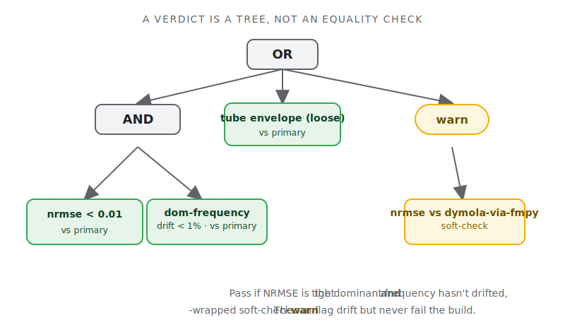

**What it is.** A Python framework for **regression and unit testing of
time-dependent system behavior** — the kind of signal a simulator, an FMU,
or a recorded test bench produces over time. It discovers tests, runs them
through whichever solver owns the model, compares the resulting trajectories
against versioned baselines, and reports. It does this across five very
different ecosystems behind one CLI: **Modelica** (Dymola and OpenModelica),
**FMU** (FMPy), **Julia / ModelingToolkit**, and **arbitrary Python** —
Modelica is just the first consumer, not the reference model.

**Why.** You cannot unit-test a simulation the way you unit-test code. A
nonlinear solver run on two machines — or two solver versions, or two
backends — will not return bit-identical floats, and it shouldn't have to.
`assertEqual(0.034, 0.034)` is the wrong question. The right question is
*"does this signal match the stored reference, within the tolerances I care
about?"* — and that question has many shapes. Sometimes it's an error norm.
Sometimes it's "stay inside this envelope." Sometimes it's "the third event
fires within 5 ms of where it used to." Every modeling team I've watched
ends up rebuilding some ad-hoc version of this comparison machinery, badly,
for their one ecosystem. DSTF is the attempt to build it once, properly, and
make the ecosystem a plug-in.[^moved]

## Highlights

- **Five backends, one entry point.** Modelica via the Dymola Python
  interface or OpenModelica's OMPython bridge; pre-built FMUs via FMPy;
  Julia models via a ModelingToolkit worker; and a Python backend that runs
  *any* `simulate(stop_time, tolerance) -> dict` — scipy, pandas, a CSV
  loader, an HTTP call. A single `testing.json` picks the backend (the first
  one whose binary exists wins), so the same config travels across machines
  without per-OS forks.

- **Six comparison modes, composable into a scoring tree.** `nrmse` (error
  over signal range), `tube` (stay inside a constant or time-varying
  envelope), `points` (checks at declared times with an x/y tolerance box),
  `range` (scalar bounds, baseline-free), `event-timing` (match solver
  events within a per-event window), and `dominant-frequency` (FFT-peak
  matching). Leaves combine with `and` / `or` / `k-of-n` / `weighted` /
  `warn` and can be scoped to a time window — so "pass if NRMSE is tight
  **and** the dominant frequency hasn't drifted, **or** the loose tube
  holds" is a tree, not a special case.

- **The baseline is the contract.** Tolerances, mode choices, and
  per-variable overrides are stored *with* the baseline, not in a side
  config that drifts out of sync. Accept a result as the new reference and
  its acceptance criteria travel with it. References are partitioned on disk
  by backend and OS, because the same library legitimately produces slightly
  different numbers under different solvers — that's a fact to record, not a
  bug to paper over.

- **The report is the IDE.** This is the part I'm most pleased with. The
  interactive HTML report isn't just a pass/fail readout — it's the
  *authoring surface* for acceptance criteria. Shift-drag a tube envelope and
  the verdict re-scores live in the browser; restructure the scoring tree;
  tune a frequency-peak table and watch the windowed FFT recompute. When
  you're happy, you download an RFC 6902 JSON-Patch and apply it from the
  command line with `dstf spec-update`. No local server, no live-apply: the
  browser is where you *compose*, the CLI is where you *execute*, and a patch
  is the clean handoff between them.

- **Three baseline roles, kept honest.** A test's **primary** baseline is the
  regression anchor and can hard-fail. **Soft-checks** — say, another
  system's reference imported for cross-comparison — are forced inside a
  `warn` wrapper by the validator, so they can flag drift but never fail your
  build. **Companions** — experimental CSVs, analytical solutions, a vendor's
  reference trace — are plot-only overlays that can never be scored against.
  The distinction sounds pedantic until the first time someone's build goes
  red because a *companion* curve moved.

## The catch: this is a regression tester, and stays one

The discipline that makes DSTF useful is mostly discipline about what it
*won't* do. It answers one question — does this signal match the reference
within tolerance — and refuses to grow into the adjacent tools. It does not
estimate parameters or calibrate models to fit data. It does not do
root-cause analysis of *why* a test failed at the physics layer; it emits
scores and diagnostics (max deviation, where, when) and hands those off to
whatever tool you use for that. It is not a simulator and never
re-implements a solver. There is no ML in the repo. Those are hard lines,
and holding them is what keeps the core small enough to trust.

A few things are deliberately still partial. **Cross-backend verification**
— running the same test through Dymola *and* an exported-FMU path and
comparing — is wired as a capability but remains experimental: a forward
bet, not a finished feature. **Event-timing** is the one comparison mode
without a live in-browser preview; its event-pairing has too many
tie-breakers to mirror faithfully in JavaScript, so it stays
CLI-authoritative. The **Julia** backend works against ModelingToolkit; the
newer Dyad front-end is untested. And a rule-based criterion *recommender* —
a layer that would look at a fresh signal and propose a starter scoring tree
— is designed but not built.

What's solid is the spine: 837 passing tests as of the latest run (including
roughly 70 browser-driven checks of the interactive report), five production
backends, a demo library for each, and a parity test suite that runs the
Python scorers and the JavaScript live-preview scorers against the same
fixtures and asserts they agree — because the worst failure mode for a
what-you-see-is-what-you-commit report is a UI that lies about the verdict.

If you build models that produce signals over time and you've ever
copy-pasted a tolerance check between two test files, this is the tool I
wish I'd had three projects ago.

[^moved]: "Behavior that moves" is the honest scope: anything time-dependent,
whether it comes from a solver, an FMU, a native binding, or a recorded
trace. The framework provides discovery, execution, baseline management,
comparison, and review; the source of the behavior is a plug-in.
