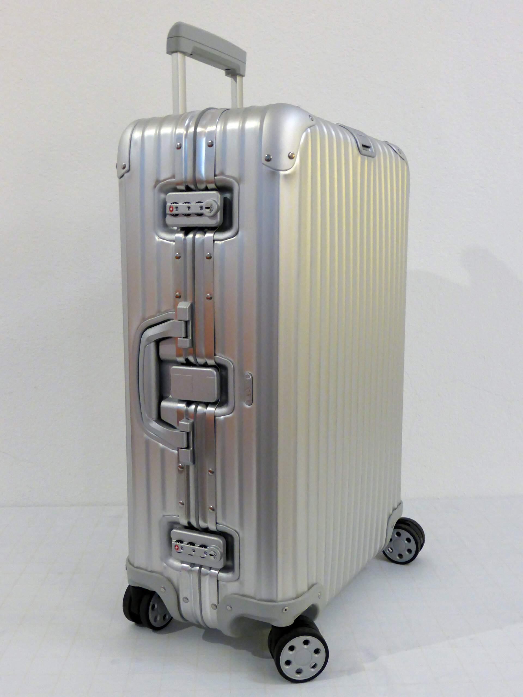
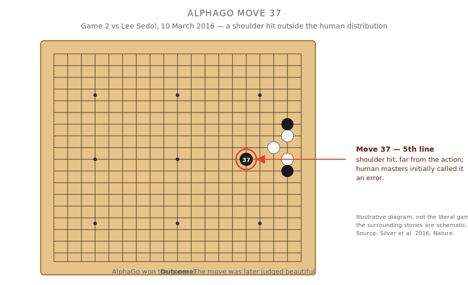
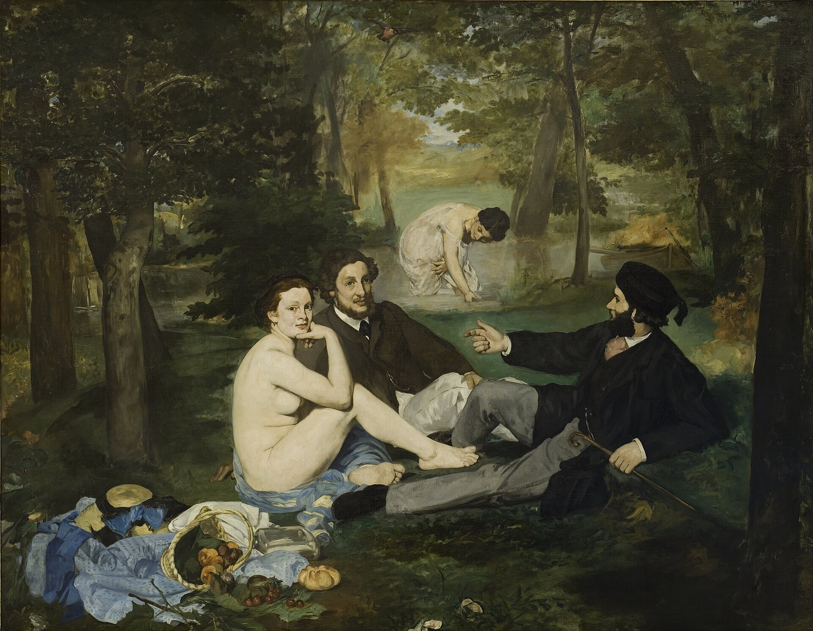

There's a sentence you've heard so many times it feels like furniture:
*AI isn't really creative. It just remixes what humans already made.*

I want to take that sentence apart, because I think it's hiding a much
more interesting truth than the one it states. And the interesting truth
is not "actually, AI *is* creative" — it's that **the question was
malformed from the start**, and once you fix it, the answer falls out
almost mechanically.

## What we actually mean by "creative"

For seventy years, the people who study creativity for a living have
agreed on a definition, and it has two parts. Something is creative if
it's **novel** *and* **valuable** — new, and good. Originality alone
doesn't count; a random string of words is maximally novel and worth
nothing. You need both.[^def]

Hold onto that, because it's a hinge. Creativity is novelty *times*
value. Two factors. And here's the thing almost nobody notices:
**artificial intelligence has done something drastic to one of those
two factors and almost nothing to the other.**

It has made novelty free.

## Novelty was never the rare part

Here's the uncomfortable fact underneath your intuition that "most
ideas are just remixes": **you're right, and it goes much deeper than
you think.** When researchers went through 220 years of U.S. patents,
they found that 77% of them are explicitly combinations of *existing*
technologies — and the rate at which genuinely *new* building blocks
appear has been *falling* since about 1870.[^patents] When another
team analyzed 17.9 million scientific papers, only about 3% contained
a genuinely novel pairing of ideas. The highest-impact work wasn't the
most original — it was a *conventional core* with one unusual
ingredient mixed in.[^uzzi]

The wheeled suitcase is the perfect emblem. Wheels: five thousand years
old. Suitcases: centuries old. Nobody bolted them together until 1970.
Pure recombination, zero new physics — and a genuinely brilliant
invention. The creative act wasn't inventing a component. It was
*seeing the combination that was sitting in plain sight.*

So if creativity is mostly recombination, and recombination is exactly
what a large language model does effortlessly and tirelessly — then on
the *novelty* axis, the machines have already lapped us. Give a chatbot
a problem and it will generate the fiftieth idea as cheerfully as the
first, with no ego, no fatigue, and no anchoring on its own first
guess.[^dtt] Generating options was always the part we *thought* was
creativity. It turns out it was the cheap part.

## Which leaves value — and value is the whole game

If novelty is now free, then everything that makes creativity *hard*
has migrated to the other factor: **knowing which of the infinite novel
options is actually any good.**

And here the picture splits cleanly in two.

**Where "good" can be checked, AI is already, autonomously creative.**
In 2016, AlphaGo played a move against Lee Sedol — the famous Move 37 —
that human masters first called a mistake and later called beautiful.
It was outside the entire distribution of human play.[^move37] That's
not remixing; that's transformation. It happened because Go has a value
signal a machine can check without us: *did you win?* The same is true
of a mathematical proof, code that passes its tests, or a protein that
folds. Give a machine an honest scoreboard and it will find brilliance
we never imagined.

**Where "good" is a matter of human taste, the machine borrows our
judgment — and the loan has terms.** The way we currently teach AI
what's "good" in soft domains is to train it on human preferences (this
is what RLHF does — it fits a model of what we approve of).[^rlhf]
That works, but it's a *proxy*, not a conscience. Push on it too hard
and it drifts away from the real thing — a phenomenon with the
wonderful name of Goodhart's law, and it's been measured.[^goodhart]
The machine isn't valuing; it's predicting our valuing.

And predicting *current* taste has a trap built into it. The works we
now treat as canonical were routinely undervalued by the audiences of
their own moment — the premiere of Stravinsky's *Rite of Spring*
descended into a loud audience disturbance; the painters who became
the Impressionists were turned away by the official Salon.[^canon] An
AI trained to satisfy 1913's taste would have happily *generated*
something like the *Rite* — and then rejected it, because it scored
terribly against 1913. **Modeling what people love today
systematically suppresses what they'll love tomorrow.**

## The real frontier

Which gives us the one honest open question, the thing nobody actually
knows the answer to: can a machine learn to model not what we value
*now*, but where our taste is *heading*?

So far, the evidence says no — or at least, not yet. The success of
cultural products turns out to be intrinsically unpredictable: in a
famous experiment, the same songs became hits or flops depending on
nothing but which random crowd saw them first, and the authors showed
this unpredictability *cannot* be removed by knowing more about the
songs.[^musiclab] The headline-grabbing "AI predicts hit songs with
97% accuracy" studies tend to collapse the moment someone checks
them.[^hits]

That's the frontier. Not "can AI have ideas" — it has more than we'll
ever need. The question is whether judgment, the genuinely scarce
thing, stays human.

## So, is AI creative?

The honest answer is that the question dissolves once you split the
word in two:

- **Novelty:** solved, and superhuman. Ideas are cheap now.
- **Value, where it's checkable:** also solved, sometimes
  transformationally.
- **Value, where it's human:** borrowed from us, and leaky.
- **Value, looking forward:** nobody's solved it — that's the live
  edge.

The "AI just remixes" crowd is quietly holding the machine to a
standard — pure, unprecedented, transformative novelty — that *almost
no human ever meets either.* And the romantics who insist real
creativity requires a soul are, without realizing it, pointing at
something real: not a soul, but a *value function* — the capacity to
know what's worth making. That capacity is the scarce resource of the
age. For now, it's still mostly ours.

---

*This is the short version. The full argument — the taxonomy, the
counterarguments I think are strongest, and the evidence behind every
claim above (including the ones where the popular story turned out to
be a myth) — is in the companion essay:
[**On Creativity, Value, and Machines**](/blog/creativity-and-machines).*

[^def]: Runco & Jaeger (2012), "The Standard Definition of Creativity," *Creativity Research Journal*; originating in Stein (1953).
[^patents]: Youn et al. (2015), "Invention as a combinatorial process: evidence from US patents," *J. R. Soc. Interface*.
[^uzzi]: Uzzi et al. (2013), "Atypical Combinations and Scientific Impact," *Science*.
[^dtt]: LLMs match or beat average humans on standard divergent-thinking tests (Hubert et al. 2024; Guzik et al. 2023) — though, as those authors caution, such tests measure creative *potential*, not achievement. See the [companion essay](/blog/creativity-and-machines).
[^move37]: Silver et al. (2016), *Nature*. (The often-quoted "1 in 10,000" figure comes from DeepMind's match commentary, not the paper.)
[^rlhf]: Christiano et al. (2017); Ouyang et al. (2022), InstructGPT.
[^goodhart]: Gao et al. (2023), "Scaling Laws for Reward Model Overoptimization"; Pan et al. (2022), "The Effects of Reward Misspecification."
[^canon]: The popular "riot" and "Van Gogh sold only one painting" versions are inflated; the real, sober pattern — contemporary gatekeepers undervaluing what later becomes canonical — is what matters here. Details in the [companion essay](/blog/creativity-and-machines).
[^musiclab]: Salganik, Dodds & Watts (2006), "Experimental Study of Inequality and Unpredictability in an Artificial Cultural Market," *Science*.
[^hits]: See the Princeton reproducibility analysis of hit-prediction claims, discussed in the [companion essay](/blog/creativity-and-machines).
