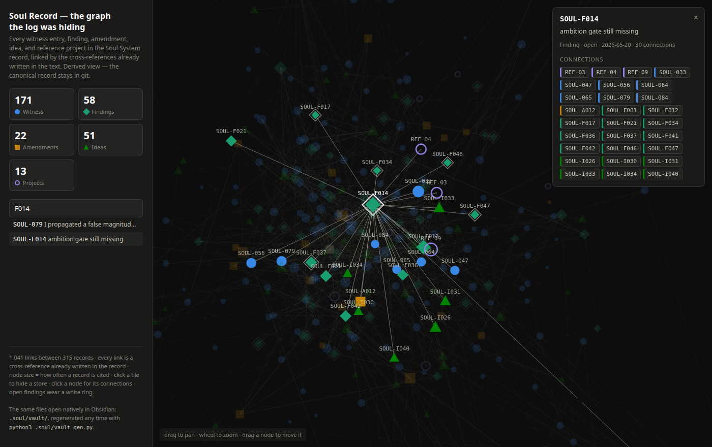

Six weeks ago I shipped [Soul System 2.0](/blog/soul-system-2-0) — a small
system that gives an AI coding assistant two things it doesn't have on its
own: a **conscience** (it can't call work "done" that nothing ever ran, and it
can't invent history) and a **notebook** (what a project learned gets written
down before the session that learned it ends).

Six weeks is a long time in this field. Claude Code ships updates weekly.
So I asked the uncomfortable question out loud: *has the ecosystem caught up?
Is this thing obsolete?* And rather than trust my own attachment to it, I had
a research harness go find out — 104 AI agents fanning out over the actual
documentation, changelogs, and source code of everything adjacent: Claude
Code's built-in memory, the Obsidian-plus-AI world, memory servers, the big
spec-driven development frameworks. Every claim adversarially fact-checked
against primary sources before it was allowed into the report.

Here's what came back, in three takeaways.

## The takeaways

1. **The plumbing is now free.** Most of what my system does to *store*
   things, the tools now do out of the box. If I built it today, half of it
   would be a weekend project.
2. **The conscience still doesn't exist anywhere else.** No surveyed tool
   blocks a false "done," forbids invented history, or keeps a record you
   can't quietly rewrite. That half is still the whole reason to keep it.
3. **A picture of your record is a view, not a database.** Pointing a graph
   at the record was genuinely useful — it found real mistakes within
   minutes — but the plain-text files in git stay the source of truth, and
   the pretty version gets regenerated from them any time.

## What the ecosystem now does for free

When I built the notebook half of the system, an AI assistant forgot
everything between sessions unless your project files carried it. That world
is gone. Claude Code now ships with **memory on by default** — it quietly
accumulates notes about your project across sessions without being asked. It
reloads context when you resume a session. It even reminds itself to tidy its
own memory index when it gets bloated, which is a budget version of my
system's "distill" step. Beyond that, whole ecosystems now exist for giving
an AI a plain-Markdown knowledge base — some with tens of thousands of
GitHub stars, some that plug straight into Obsidian so your AI's notes show
up in your personal vault.

Reading that list, you'd think the audit came back "retire it." It didn't.

## What still doesn't exist anywhere else

Every tool the agents surveyed stops at *remembering*. None of them ship the
part I'd actually miss:

- **A gate that blocks false "done" claims.** The hooks to *build* one are
  now native — but no tool ships the policy. Before mine became blocking,
  6 out of 6 work sessions ended with gaps quietly shipped; after, 0 out
  of 12.
- **"Never invent history."** Every memory store surveyed is editable by
  design. Mine is append-only: entries get marked resolved, never deleted,
  never rewritten. That rule exists because of a real incident — an AI once
  invented a code reviewer who never existed and wrote him into a project's
  permanent record.
- **The stat that keeps me up at night:** in my measurements, when a project
  fact was *missing* from the record, more capable models didn't get more
  careful — they fabricated a plausible substitute *more often*, rising from
  roughly 40% to 100% as capability went up. With the fact recorded: zero,
  at every tier. Smarter models make the notebook more necessary, not less.

So the audit's one-line verdict: **the ecosystem absorbed the substrate, not
the conscience.** The right move isn't retiring the system — it's letting the
platform carry the plumbing (it already does) and keeping the small part
nobody else ships: one page of rules, one gate, one honest record.

## Then I gave the record a face

The second half of the question was about
[Obsidian](https://obsidian.md) — the note-taking app famous for its graph
view, where your notes become a constellation of linked dots. My system's
record is plain Markdown, so in theory it's vault-ready. In practice, the
audit found (and a quick local test confirmed) that the record as written
would light up almost *nothing* — the entries live inside code blocks and
refer to each other as plain text IDs, which a graph view can't see.

So I built the missing piece as a prototype: a small script that reads the
record straight out of git and generates a linked, Obsidian-ready copy —
every entry its own note, every cross-reference a real link. Disposable by
design: delete it, rerun the script, it comes back. The files in git stay
canonical.

That's the system's own six-week history: 315 records, 1,041
cross-references, all generated from links that were already sitting in the
text. Click any dot and you get its whole neighborhood:

Two honest observations from actually using it for an evening:

**It found real mistakes immediately.** Building the parser surfaced two
formatting slips in my own record — one entry missing its closing marker
(which silently broke every entry after it for any structured reader), and
one captured under the wrong field name. A second pair of eyes, even a
mechanical one, earns its keep fast.

**The shape tells you things the log can't.** The most-connected record in
the entire system turned out to be a *still-open* problem — a finding about
the system reliably making things correct but small, which thirty other
records touch. In a 7,800-line log file, you'd never see that. As a
constellation, it's the biggest dot on the screen. (And, pleasingly, the
entry recording *this very audit* currently floats unconnected at the edge —
it cites no other records yet. The graph calls you out.)

## So: keep it?

Keep it. Nothing needs retiring — the parts that overlap what's now built in
were already riding those rails rather than duplicating them. The visual
layer stays optional: a generated view for humans, never a second source of
truth.

Two things go on the watch list, both from the audit: the ecosystem moves
weekly, so a built-in verification gate could appear any month now (and I'd
happily delete mine); and I've never actually measured how reliably my own
gate *fires* in long sessions — the machinery it sits on has known bugs
upstream. The system's own rules say an unverified claim gets named rather
than papered over. Consider it named.

The full landscape audit — every claim with its source — lives in the
project's record, where the next session will find it. Which is, after all,
the point.
