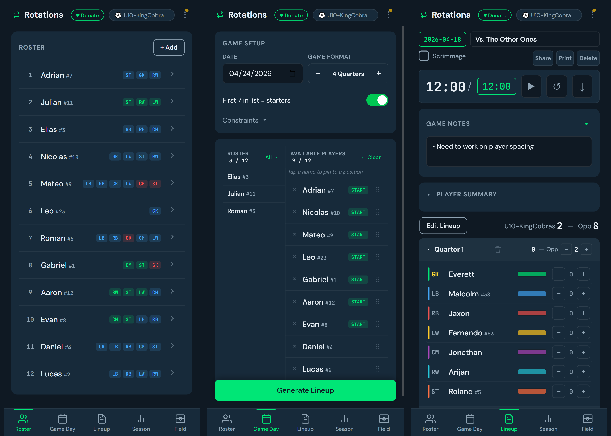

import vidOverview from './overview.mp4';

**What it is.** A web app that does one unglamorous job well: it builds a
fair lineup rotation for a youth sports team. You enter a roster, mark who
showed up, pick a format — four quarters, two halves, whatever — and it
produces a period-by-period lineup where every kid plays as close to the
same amount as the arithmetic allows. It runs in a browser, installs to a
phone's home screen, works with no signal on the sideline, and keeps all
its data on the device. There is no account, no server, and no build step
in the codebase — it's plain HTML, CSS, and JavaScript served as a static
site, with an additive [Capacitor](https://capacitorjs.com/) layer that
wraps the *same* source into an Android app.

**Why.** "Everyone plays equal time" is the easiest promise a youth coach
can make and the hardest to keep by hand. Kids miss games. Some positions
are scarce. A parent is watching the clock for their kid specifically, and
they will notice if Quarter 4 went sideways. Tracking all of that on a
clipboard while also, you know, coaching, is the actual problem. The app's
bet is that fairness is a scheduling problem with a clean optimum, and that
a coach should be able to trust the output enough to hand it the clipboard.

## Highlights

- **Fairness has a strict priority order.** The engine balances four
  things, and the order is the whole design: equal playing time *this
  game* comes first; equal playing time *across the season* second;
  spreading players across *different positions* third; and per-player
  position *preferences* last. Earlier goals dominate later ones, so the
  app never trades a kid's playing time for the sake of giving someone
  their favorite position.

- **Fairness is a ratio, not a tally.** Season fairness is measured as
  *periods played ÷ periods available*, computed only over games a player
  actually attended. A kid who shows up to five games is treated exactly
  like one who shows up to ten — missing a game neither punishes nor
  rewards you. This "absence neutrality" is the single decision that makes
  the season stats feel fair to parents rather than arbitrary.

- **Brute force, on purpose.** Each period's position assignment is solved
  by checking every permutation rather than reaching for the Hungarian
  algorithm. For a 9-position lineup that's ~363,000 arrangements, which a
  phone clears in milliseconds; even an 11-a-side football lineup stays
  under a second. The payoff is code you can read top to bottom and an
  answer that is provably optimal, with zero matrix-library dependencies.

- **The lineup is a live document.** After generating, the coach can tap
  two players to swap them, sub a kid off the bench, add a late arrival, or
  remove someone who got hurt — and the rest of the game rebalances around
  the change. Every edit saves immediately, so the season stats always
  reflect what actually happened on the field, not what was planned.

- **One field diagram engine, several sports.** A separate Field tab draws
  a to-scale pitch / court / rink / diamond as SVG, with draggable position
  dots, freehand route and zone drawing, a defensive overlay, and saved
  plays. Formations are deliberately *visual only* — they move dots around
  the field but never touch the rotation engine, so changing your shape can
  never break the fairness math or invalidate a stat.

- **One codebase, two distribution channels.** The PWA is the default
  target and ships to GitHub Pages untouched. A thin Capacitor wrap mirrors
  the same JS into an Android project for the Play Store — including a small
  native bridge for printing a lineup and the system share sheet for
  backups — without forking the source or adding a framework.

<video controls preload="metadata" width="280">
  <source src={vidOverview} type="video/mp4" />
  A walkthrough: build a roster, generate a lineup, edit it on the sideline.
</video>

## A lesson worth keeping

The most useful structural decision was separating *hard guarantees* from
*soft niceness*, and refusing to let the second touch the first.

The hard layer decides how many periods each player gets — the
equal-time-then-season-fairness arithmetic. Once that's fixed, a second
layer decides *which* periods, using tiebreakers that only ever fire when
the hard layer is indifferent. Those tiebreakers do the things a coach
would do by instinct: spread a kid's two rest periods apart instead of
benching them for the whole middle of the game, and give someone a breather
after a long streak on the field. They make the lineup feel humane.

The temptation, every single time, is to let the nice-to-have leak upward —
"just this once, let him sit an extra period so the rotation looks cleaner."
The discipline that paid off was making that structurally impossible: the
spacing logic is mathematically incapable of changing anyone's total
playing time, because it only sorts within ties the fairness layer already
declared even. A coach can override any individual decision by hand, but
the engine cannot quietly trade fairness for tidiness. That boundary is the
reason the output is trustworthy enough to hand someone a clipboard built
from it.

It's also honest about where it stops. The engine optimizes *fairness*, not
*winning* — it has no notion of matchups, momentum, or specializing your
best players late in a close game; that's a different tool for a different
kind of team. There's no cloud sync, because the privacy answer the app
wanted to give the Play Store was "this app collects nothing," and the way
you earn that answer is by genuinely sending nothing anywhere. Knowing
which problems it deliberately doesn't solve is half of what makes the one
it does solve dependable.

---

*Roster Rotation is live and installable at
[greenwoodms06.github.io/roster-rotation](https://greenwoodms06.github.io/roster-rotation/),
and the full feature tour and design rationale live on the
[project page](/projects/roster-rotation).*
