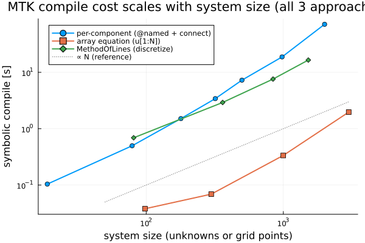

**What it is.** A bounded reactor thermal chain — fuel pin → coolant channel →
loop — built in Julia with ModelingToolkit's acausal connectors. It's a
like-for-like rebuild of the Python **[netflow episode](/blog/netflow-python-episode)**
physics, then benchmarked head-to-head against it.

**Why.** netflow's abstraction turned out to be exactly what ModelingToolkit
already does, so the natural next step was to rebuild it the "proper" way and
measure what you actually gain and lose.

## Highlights

- **Matched the hand-rolled solver to ~25 mK** node-by-node, reproducing the same
  physics in roughly **14× less hand-written code** (98 LOC vs ~1342).
- **Julia's numerics matched or beat Python at scale** — about 1.7× faster at
  10k nodes and at parity by 90k, and that's conservative, since the Julia solve
  is nonlinear where Python's was linear.
- **Cross-domain composition is the real payoff.** Wiring a point-kinetics power
  block (a signal-domain model) into the thermal network to close the Doppler
  feedback loop was friction-free — exactly the thing a hand-rolled solver makes
  painful.

## The catch: the wall is code generation, not math

The numerics are great; *compiling* the model is the bottleneck. `mtkcompile`
scalarises per-component, so symbolic compilation grows as roughly N^1.6 —
extrapolating to an estimated **25–40 minutes just to compile** (not solve) the
17×17×30 PWR assembly. We never ran it. A shipping fix exists
(JuliaSimCompiler.jl), but it's gated behind the JuliaHub registry.

What MTK *got right* — slices 1–10 behaved exactly like the Modelica leg at the
same scales: same equations, same numbers, same debugging surface. The
acausal-symbolic paradigm is sound. The pain points were ecosystem gaps (no
IF97 binding, no stream `FluidPort` in `MTKStandardLibrary`, the gated
JuliaSimCompiler escape), not the language. That's the spine of the
[capstone comparison](/blog/three-walls-comparison).

All comparisons here are code-to-code, not validation against physical
measurement.
