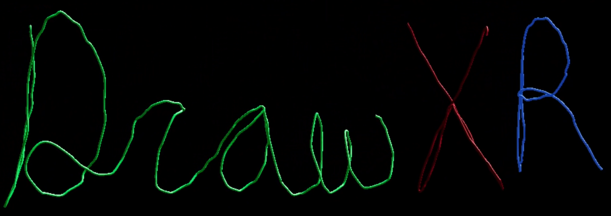
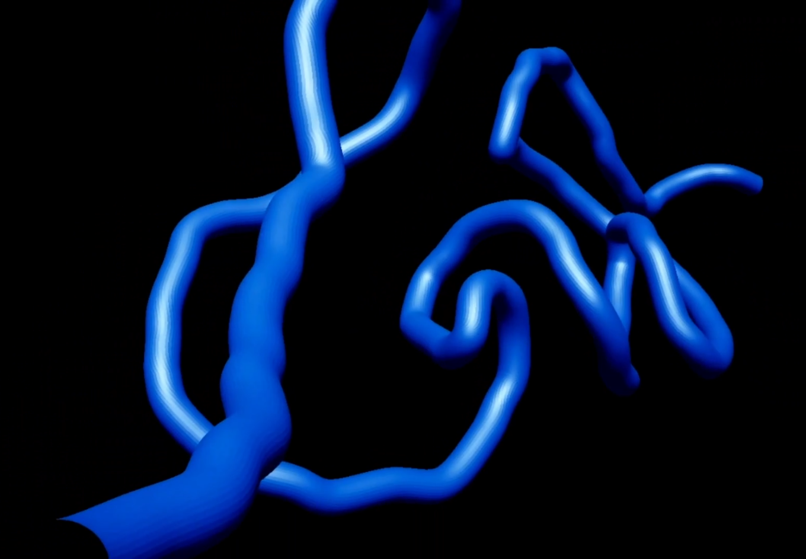
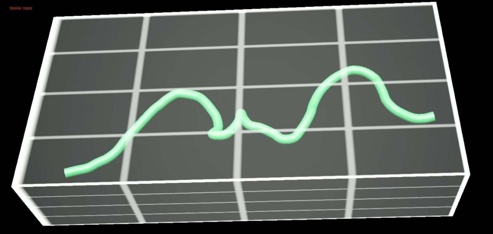
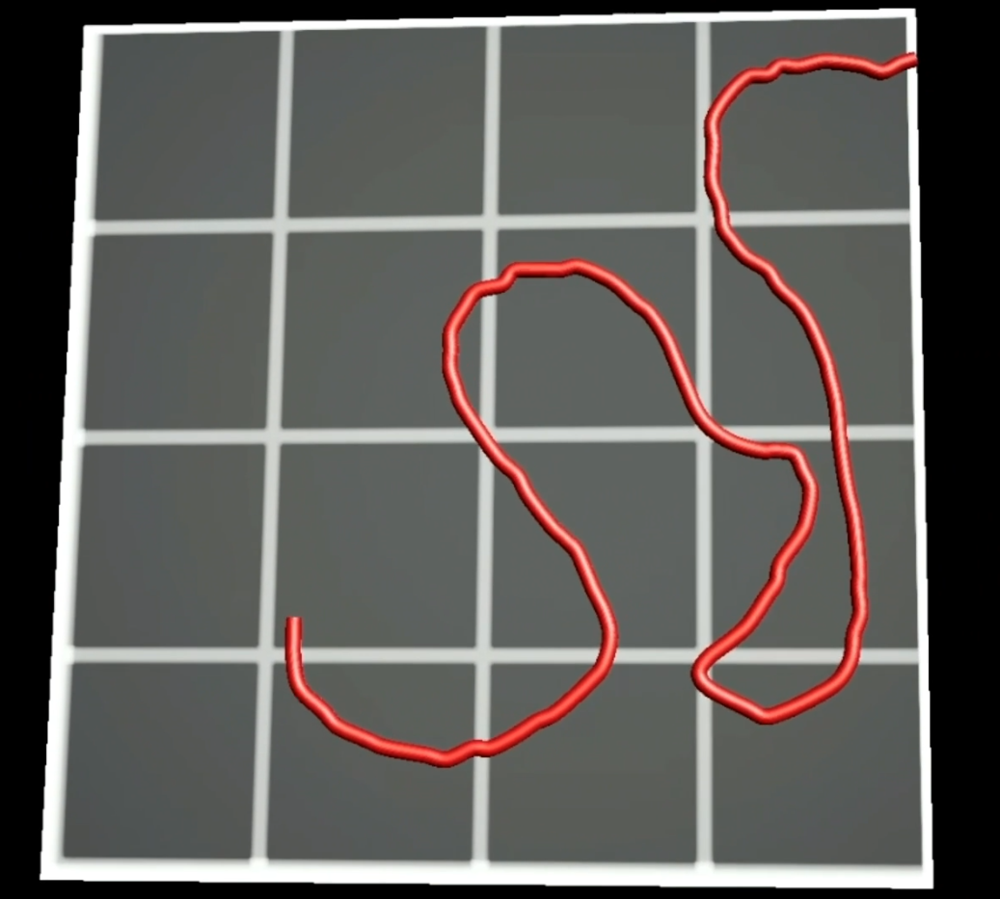
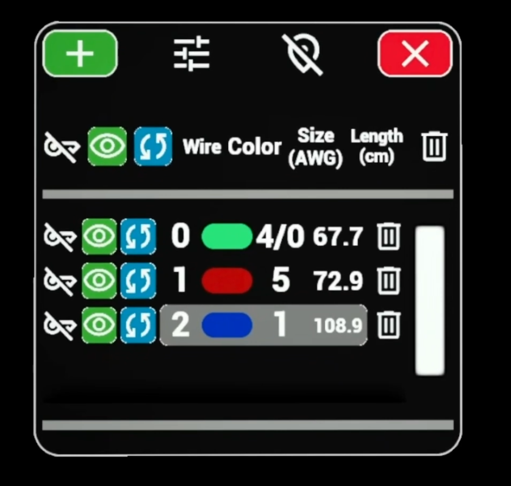
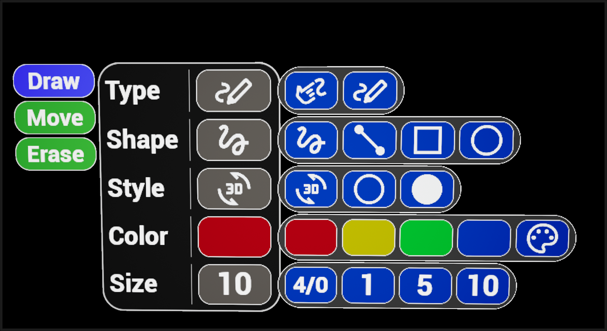

**What it is.** A proof-of-concept Unreal Engine plugin for drawing in
**AR / VR / MR** — collectively "XR" — built and tested on the **Quest 3**
with the MetaXR plugin.

**Why.** The original ask wasn't "let users draw" — it was *"let users
track wires"*. Plotting routes through a physical space, marking up a
mock-up, leaving annotations a teammate can see. So the focus is on a
**wire manager** that tracks each stroke and knows its
electrically-meaningful properties — color, gauge (AWG), and length in
centimeters — alongside the small set of styling controls.

## Drawing modes

Two input paths — **finger pinches** or **stylus** — feeding three
geometric modes:

| Mode | What it does |
|---|---|
| **Free 3D** | Strokes anywhere in space |
| **Volume-constrained 3D** | Snap strokes to a 3D shape — sphere, ellipsoid, box, or arbitrary mesh, internally or externally |
| **2D plane** | Strokes pinned to a flat surface |

| | | |
|---|---|---|
|  | |   |
| *3D free draw* | *3D volume constrained* | *2D plane mode* |

## Wire management

Every stroke is a *wire* — selectable, recolorable, resizable, and
length-aware. The management menu lists each one with its **color**,
**gauge (AWG)**, **length in centimeters**, and per-wire visibility /
delete controls:

| | |
|---|---|
|  |  |

Three wires shown here (green at 4/0 AWG / 67.7 cm; red at 5 AWG /
72.9 cm; blue at 1 AWG / 108.9 cm) — the menu treats each stroke as a
physical conductor the user is laying out, not just a visual mark. That
abstraction — *strokes-as-tracked-wires* — is what the plugin is focused on: managed wires not free art.
