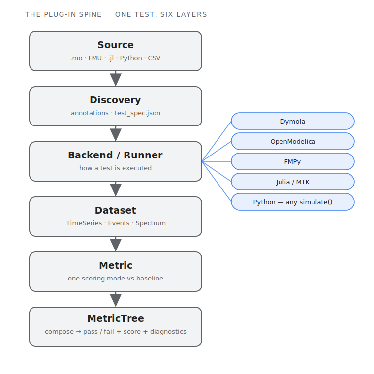

**What it is.** A Python framework for **regression and unit testing of
time-dependent system behavior** — solver trajectories, FMU outputs, Julia
models, recorded test-bench traces. It discovers tests, runs each through
whichever backend owns the model, compares the result against versioned
baselines within tolerances *you* declare, and reports. One CLI spans five
ecosystems; the ecosystem is a plug-in, not a special case — Modelica is just
the first consumer, not the reference model.

It answers exactly one question — *does this signal match the stored
reference within tolerance?* — and the discipline is in refusing to grow
past it. See [the launch post](/blog/dstf) for why that boundary is the
point.



## Five backends, one entry point

Each backend declares capability flags rather than being special-cased, with
persistent-worker support where it pays off.

| Backend | Source kind | Notes |
|---|---|---|
| **Dymola** | Modelica `.mo` | Python interface; falls back to batched `.mos` |
| **OpenModelica** | Modelica `.mo` | OMPython ZMQ; falls back to `omc -s` |
| **FMPy** | Pre-built FMU | `fmpy.simulate_fmu` in-process |
| **Julia / MTK** | `.jl` ModelingToolkit | stdin-JSON pipe; the newer Dyad front-end is untested |
| **Python** | any `simulate(stop_time, tol) -> dict` | scipy, pandas, a CSV loader, an HTTP call — anything |

A single `testing.json` is the entry point; the first `simulators` entry
whose binary exists wins, so the same config travels across machines without
per-OS forks.

## Six comparison modes, composed into a MetricTree

You don't assert float-equality on a solver trajectory — you score it. DSTF
ships six modes and composes them into a tree.

| Mode | What it scores |
|---|---|
| `nrmse` | RMSE over signal range — the default |
| `tube` | Signal stays inside a constant or time-varying envelope around the reference |
| `points` | Per-point checks at declared times with an x-tolerance box and abs/rel y-tolerance |
| `range` | Scalar `min`/`max` bounds — baseline-free |
| `event-timing` | Match solver events against a declared list within per-event tolerance |
| `dominant-frequency` | FFT-peak matching against a declared peaks table — windowable |

Leaves combine with `and` / `or` / `k-of-n` / `weighted` / `warn`, can scope
to a time window, and target named baselines — so a verdict is a tree, not a
single equality check.

## The baseline is the contract

Tolerances, mode choices, and per-variable overrides live *with* the
baseline, not in a side config that drifts out of sync. Accept a result as
the new reference (`--accept`) and its acceptance criteria travel with it.
References are partitioned on disk by backend and OS — the same library
legitimately produces slightly different numbers under different solvers, and
that's a fact to record, not a bug to paper over. Each test carries up to
three baseline roles:

- **primary** — the regression anchor; can hard-fail. At least one scoring
  leaf must target it outside a `warn` wrapper.
- **soft-checks** — imported foreign references, forced inside a `warn`
  wrapper by the validator, so they flag drift but never fail the build.
- **companions** — plot-only overlays (experimental CSVs, analytical
  solutions, vendor traces) that can never be scored against.

## The report is the IDE

The interactive HTML report is the *authoring surface* for acceptance
criteria, not just a pass/fail readout. Shift-drag a tube envelope and the
verdict re-scores live in the browser; restructure the tree; tune a
frequency-peak table and watch the windowed FFT recompute. When you're happy,
download an RFC 6902 JSON-Patch and apply it from the command line with
`dstf spec-update`. No server, no live-apply: the browser is where you
*compose*, the CLI is where you *execute*, and the patch is the handoff. A
scorer-parity suite runs the Python scorers and the JavaScript live-preview
scorers against the same fixtures and asserts they agree — because the worst
failure mode for a what-you-see-is-what-you-commit report is a UI that lies
about the verdict.

## Install

```bash
uv tool install dstf        # then run plain: dstf ...
# or: pipx install dstf
```

Developers:

```bash
uv pip install -e ".[dev]"             # core + pytest
uv pip install -e ".[dev,fmpy,om]"     # plus FMPy + OpenModelica extras
uv run dstf --help
```

The Julia backend needs Julia 1.11+ and a one-time `Pkg.instantiate()` on the
demo project; the Python `SimpleRamp` example needs `scipy`.

## First run

The repo ships a demo library for each backend. The easiest first run is the
Modelica demo:

```bash
uv run dstf --config examples/modelica/ModelicaTestingLib/Resources/ReferenceResults/testing.json run
```

It reads `testing.json`, discovers the demo tests, runs each in a persistent
simulator worker, partitions output under `testing_output/` by backend + OS,
compares against the `ref_NNNN.json` baselines, and prints pass/fail. Add
`--report ./reports` for the interactive HTML reporter; `--parallel N` prints
a live dashboard URL that auto-refreshes.

## A few commands

```bash
uv run dstf --config testing.json discover                 # find tests, don't run
uv run dstf --config testing.json run --accept             # accept current results as baselines
uv run dstf --config testing.json run -i failed            # interactive review by category
uv run dstf --config testing.json run --parallel 4 --report ./reports
uv run dstf --config testing.json spec-update patch.json   # apply a reporter-exported JSON-Patch
uv run dstf --config testing.json run --report-format junit --output test-results.xml   # CI
```

## Scope — and what it refuses to be

DSTF is a regression tester, full stop. It does **not** estimate parameters
or calibrate models to data, does **not** do physics-layer root-cause
analysis (it emits scores and diagnostics and hands those off), is **not** a
simulator, and hosts **no** ML. Those anti-goals are the design — an economy
of tools that keeps the core small enough to trust. A few capabilities are
deliberately still partial: **cross-backend verification** (Dymola → exported
FMU → FMPy) is wired but experimental; **event-timing** is the one mode
without a live in-browser preview (it stays CLI-authoritative); the Julia
**Dyad** front-end is untested; and a rule-based criterion **recommender** is
designed but not yet built.

The solid spine: 837 pytest passing as of the latest run (≈70 Playwright
browser tests), five production backends, a demo library for each, and the
scorer-parity suite that keeps the report honest.
