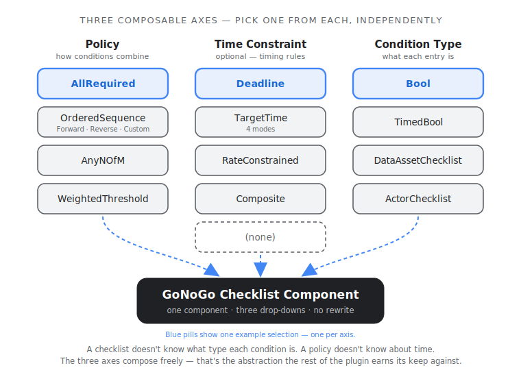
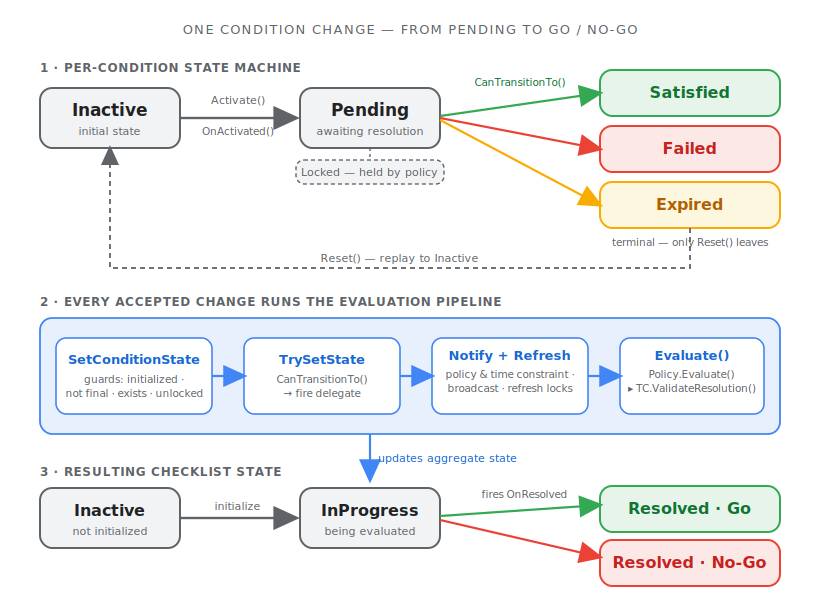

import vidSplash from './splash.mp4';

<video autoPlay loop muted playsInline controls>
  <source src={vidSplash} type="video/mp4" />
</video>

**What it is.** An Unreal Engine plugin for **checklists** — broadly
construed. A checklist is just *a set of conditions that have to be
satisfied before a game event fires*, and once you say it that way, the
same plugin handles quest prerequisites, crafting recipes, safety/launch
sequences, timed challenges, and hierarchical mission trees.

**Why.** Every team building a non-trivial game eventually rolls their own
checklist code, and it always ends up entangled with how the conditions
combine (all of these? any 3 of 5? in order?), how time bounds get
enforced, and what each "condition" actually represents. GoNoGo separates
those three axes cleanly so you don't have to.

## The architectural punchline — three composable axes

| Axis | Options |
|---|---|
| **Policy** — how conditions combine | AllRequired · OrderedSequence (Forward/Reverse/Custom) · AnyNOfM · WeightedThreshold |
| **Time constraint** *(optional)* — timing rules | Deadline · TargetTime (4 modes) · RateConstrained · Composite |
| **Condition type** — what each entry represents | Bool (simple flag) · TimedBool (per-condition deadline) · DataAssetChecklist (nested sub-checklist) · ActorChecklist (observe external actor) |

A checklist doesn't know what kind of condition each entry is. A policy
doesn't know about time constraints. The three axes compose independently
— and that's the abstraction the rest of the plugin earns its keep
against.

## What it does well

- **Mix the axes freely.** *"All required, but only if completed within
  60 seconds, where 3 of the items are themselves sub-checklists"* is
  one component plus three drop-downs, not a rewrite.
- **Three setup paths, same plugin.** Inline editor properties for the
  simplest case; **DataAssets** for shared/templated checklists across
  many actors; runtime C++ when you need full control. The component
  swaps between them transparently.
- **Async Blueprint nodes.** `Wait for Checklist Resolved` and
  `Wait for Condition State` are latent nodes that fit the same idiom
  as UE's `Delay` — drop them into a graph, no boilerplate.
- **Save / restore that respects hierarchy.** A checklist with nested
  sub-checklists serializes recursively, and replay on restore suppresses
  external delegates so gameplay listeners don't fire as if the events
  were happening live.
- **DataAsset validation at edit time.** The validator catches null
  policies, duplicate condition IDs, impossible AnyNOfM thresholds,
  phantom IDs in custom orderings, and transitive cycles through nested
  DataAsset references. Invalid assets show red in the Content Browser
  before they break runtime.

## How a checklist resolves

Each entry is a little state machine — `Inactive → Pending → Satisfied /
Failed / Expired` — and every accepted change runs the same evaluation
pipeline: notify the policy and time constraint, refresh locks, then
`Evaluate()` (the policy proposes a result, the time constraint gets to
veto it). That single pipeline is what turns individual condition changes
into the checklist's aggregate **Go / No-Go**.

## The launch-demo

GoNoGo ships with a **multi-station launch sequence** that exercises
every major feature through a realistic two-attempt scenario. Five
self-contained station actors — Propulsion, Navigation, Safety, Ground
Control, Launch Pad — each own their own checklist. A director actor
orchestrates the sequence with 32 assertions.

- **Attempt 1** progresses through Propulsion and Navigation cleanly, but
  Safety fails (weather + tracking both go down, dropping below the
  3-of-4 threshold) → master No-Go → scrub.
- **Attempt 2** resets everything and runs clean → launch.

## Extending

GoNoGo is designed to be extended. Three extension points,
each a single subclass:

- **New condition type** — subclass `UGoNoGoCondition`. Override
  `CanTransitionTo()`, `OnActivated()`, `CheckTimeConstraint()`.
- **New policy** — subclass `UGoNoGoEvaluationPolicy`. Implement
  `Evaluate()` (required), override the lifecycle hooks as needed.
- **New time constraint** — subclass `UGoNoGoTimeConstraint`, override
  `OnActivated()` / `CheckTimeConstraints()` / `ValidateResolution()`.
- **Custom time source** — implement `IGoNoGoTimeSource` and inject via
  `SetTimeSource()` (so deterministic-time tests and replay can drive
  the clock manually).