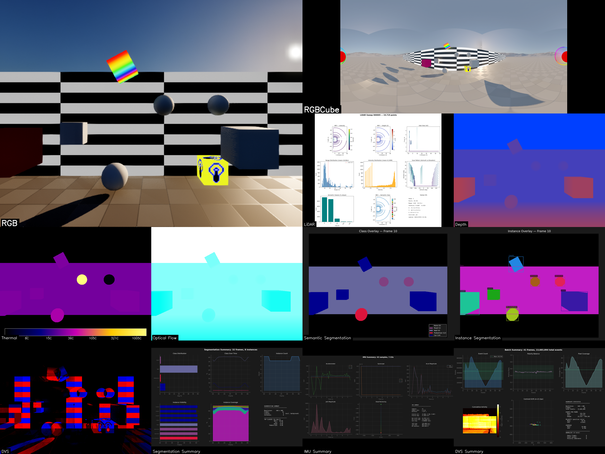

**What it is.** An Unreal Engine plugin that turns a virtual scene
into a multi-sensor capture rig. Cameras, depth, semantic segmentation,
event cameras, optical flow, IMUs, LiDAR, and thermal — all recording
the *same world* on a *shared clock* with **nanosecond timestamps**.
The point is **fused** data, not just *parallel* data.

**Why.** Training perception models or evaluating sensor placements
needs more than "a camera feed and a depth map" — you need every
modality timestamped against the same frame, with the actor poses and
velocities tracked alongside, in a deterministic pipeline you can rerun
to byte-identical output. RealisticSensors is the rig for that.

## Sensors — physics, not just feeds

Each sensor has a documented technique behind it:

| Sensor | Technique |
|---|---|
| `UCameraSensorBase` | base RGB capture; foundation for the others |
| `USceneCaptureCubeSensor` | 6-face panoramic capture |
| `UDepthSensor` | linear depth in Unreal units |
| `USemanticSegmentationSensor` | per-pixel class IDs from UE's Custom Stencil buffer (0-255 classes), plus optional **instance segmentation** via material override capture pass (up to 65,535 unique instances) |
| `UDVSSensor` | event camera — per-pixel asynchronous brightness-change events; each pixel fires when its log-luminance changes by a threshold |
| `UOpticalFlowSensor` | per-pixel screen-space motion vectors lifted directly from UE5's velocity buffer; exported in standard ML formats |
| `UIMUSensor` | 6-DOF accelerometer + gyroscope; computes linear acceleration and angular velocity by finite-differencing the component transform, output in the sensor body frame |
| `ULiDARSensor` | CPU raycasting; supports **mechanical rotating** scanners, **solid-state flash** arrays, and **non-repetitive (Livox-style)** patterns; returns surface normals, Lambertian intensity, semantic/instance labels, and sweep-aligned metadata |
| `UThermalSensor` | synthetic LWIR (8–14 μm); maps stencil class IDs to physically-motivated apparent temperatures via Stefan-Boltzmann radiance with per-class emissivity, solar loading, and environment reflection — reuses the segmentation stencil pipeline so zero extra scene prep |

## What makes the rig useful

- **Synchronized capture.** All sensors share one clock. Frame-accurate,
  nanosecond timestamps across every modality — so a depth pixel, an
  RGB pixel, and a LiDAR return at "frame 1234" really do refer to the
  same instant.
- **Three control modes.** **Manual** (user code drives capture),
  **Group** (per-actor sensor groups via `USensorController`),
  **World** (global recording session via `USensorWorldSubsystem`) —
  pick the granularity that matches the experiment.
- **Actor tracking by tag.** Tag any actor with `RS_Track` and its
  transform / bounds / velocity export alongside the sensor data, with
  `RS_Name:<id>` to give it a stable identifier.
- **Async export.** Non-blocking file I/O with backpressure control, so
  the simulation doesn't stall on disk.

## Reproducible datasets via Level Sequencer

A separate **render_api** subsystem drives deterministic dataset
generation from JSON configs through Unreal's Level Sequencer — runnable
from a terminal (`python run_workflow.py config.json`) or from the
in-editor Python console. Configs declare the level, the sequence
length, FPS, actors, and per-actor keyframes; the output is byte-for-byte
reproducible.

## Companion Python suite

`sensor_analysis/` ships per-modality analyzers (DVS / optical-flow /
IMU / segmentation / LiDAR / thermal / depth / scene-capture), each
with a README and a technical doc. General tools include a grid-video
compositor (multi-sensor side-by-side video with optional frame sync)
and HDF5 compression / timestamp analysis utilities.