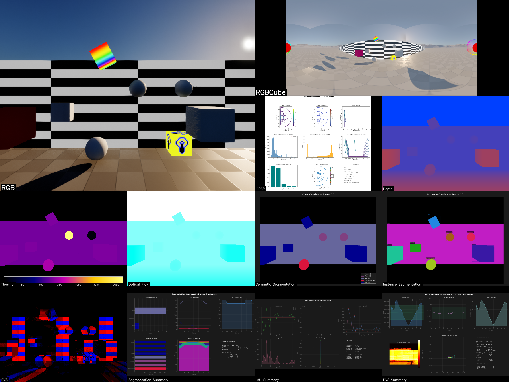
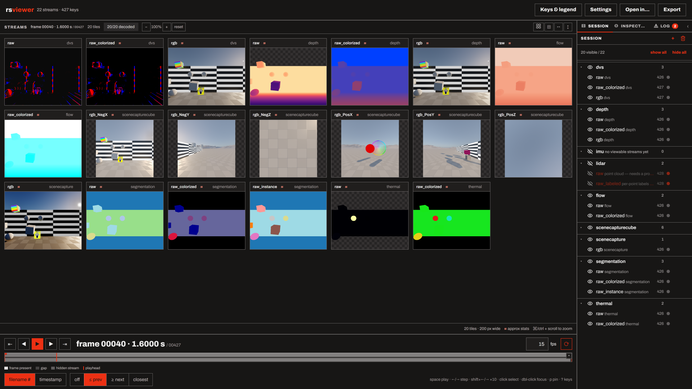

**Three tools, one capture contract.** RealisticSensors began as a single
Unreal Engine plugin. It is now three repositories that share one thing: the
on-disk shape of a capture. The plugin writes it, Forge reads it, and the
viewer opens it — and each can move without the others.

| Tool | Does | CLI | License | Since |
|---|---|---|---|---|
| [RealisticSensors](https://code.ornl.gov/varsa/unreal/plugins/RealisticSensors) | Records — UE 5.6+ plugin | — | Apache-2.0 OR MIT | 2025-12-18 |
| [RealisticSensorsForge](https://code.ornl.gov/varsa/unreal/plugins/RealisticSensorsForge) | Analyzes, fuses, exports — Python 3.11+ | `rsforge` | MIT | 2026-02-20 |
| [RealisticSensorsViewer](https://code.ornl.gov/varsa/unreal/plugins/RealisticSensorsViewer) | Views — local web app | `rsview` | MIT | 2026-08-17 |

## The plugin

**What it is.** An Unreal Engine plugin that turns a virtual scene into a
multi-sensor capture rig. Cameras, depth, semantic segmentation, event
cameras, optical flow, IMUs, LiDAR, and thermal — all recording the *same
world* on a *shared clock* with **nanosecond timestamps**. The point is
**fused** data, not just *parallel* data.

**Why.** Training perception models or evaluating sensor placements needs
more than "a camera feed and a depth map" — you need every modality
timestamped against the same frame, with the actor poses and velocities
tracked alongside, in a deterministic pipeline you can rerun to byte-identical
output.

Each sensor has a documented technique behind it:

| Sensor | Technique |
|---|---|
| `UCameraSensorBase` | base RGB capture; foundation for the others |
| `USceneCaptureCubeSensor` | 6-face panoramic capture |
| `UDepthSensor` | linear depth in Unreal units |
| `USemanticSegmentationSensor` | per-pixel class IDs from UE's Custom Stencil buffer (0-255 classes), plus optional **instance segmentation** via material override capture pass (up to 65,535 unique instances) |
| `UDVSSensor` | event camera — per-pixel asynchronous brightness-change events; each pixel fires when its log-luminance changes by a threshold |
| `UOpticalFlowSensor` | per-pixel screen-space motion vectors lifted directly from UE5's velocity buffer; exported in standard ML formats |
| `UIMUSensor` | 6-DOF accelerometer + gyroscope; computes linear acceleration and angular velocity by finite-differencing the component transform, output in the sensor body frame |
| `ULiDARSensor` | CPU raycasting; supports **mechanical rotating** scanners, **solid-state flash** arrays, and **non-repetitive (Livox-style)** patterns; returns surface normals, Lambertian intensity, semantic/instance labels, and sweep-aligned metadata |
| `UThermalSensor` | synthetic LWIR (8–14 μm); maps stencil class IDs to physically-motivated apparent temperatures via Stefan-Boltzmann radiance with per-class emissivity, solar loading, and environment reflection — reuses the segmentation stencil pipeline so zero extra scene prep |

What makes the rig usable rather than just a pile of sensors:

- **Synchronized capture.** All sensors share one clock, so a depth pixel, an
  RGB pixel, and a LiDAR return at frame 1234 refer to the same instant.
- **Four control modes.** `Manual` (user code drives capture), `Group`
  (per-actor sensor groups via `USensorController`), `World` (a global
  recording session via `USensorWorldSubsystem`), and `WorldPriority` (both,
  world preferred).
- **Actor tracking by tag.** Tag any actor `RS_Track` and its transform,
  bounds, and velocity export alongside the sensor data; `RS_Name:<id>` gives
  it a stable identifier.
- **Async export.** Non-blocking file I/O with backpressure control, so the
  simulation doesn't stall on disk.
- **Level Sequence workflow.** A `render_api` subsystem drives deterministic
  dataset generation from a JSON config through Unreal's Level Sequencer —
  level, sequence length, FPS, actors, and per-actor keyframes declared up
  front; anything named in the config gets `RS_Track` added automatically.

A capture lands as `Saved/RealisticSensors/<Session>/<Actor>/<Sensor>/` with
one subfolder per output method (`rgb/000000.png`, `depth/000000.exr`, …), a
`metadata/` folder of per-frame JSON (frame number, nanosecond timestamp,
sensor pose, camera intrinsics, output paths), and a `TrackedActors/` folder
beside the actors. That layout is the contract everything else builds on.

## Forge

**What it is.** The Python side, split out of the plugin repo on 2026-07-02.
One analysis package per sensor type, all behind a single `rsforge` CLI, plus
the cross-sensor tools that need more than one lane at once.

| Lane | Command | What it produces |
|---|---|---|
| `dvs` | `rsforge dvs` | event-camera visualizers: polarity, density, time surface |
| `flow` | `rsforge flow` | optical-flow colorization and magnitude analysis |
| `imu` | `rsforge imu` | accelerometer / gyroscope time series and trajectory |
| `segmentation` | `rsforge segmentation` | semantic / instance class maps and consistency |
| `lidar` | `rsforge lidar` | point-cloud processing, BEV rendering, export |
| `thermal` | `rsforge thermal` | Ironbow colorization and temperature distributions |
| `depth` | `rsforge depth` | depth colorization, edge detection, coverage |
| `scenecapture` | `rsforge scenecapture` | RGB quality metrics: brightness, sharpness, temporal difference |
| `scenecapturecube` | `rsforge scenecapturecube` | cubemap panoramas, seam analysis, equirectangular projection |

- **Run-all.** `rsforge run-all <path>` discovers sensors **by structure** —
  it walks for folders containing `sensor_config.json` and classifies each by
  its `sensor_type`, never by folder name — so you can point it at a session
  root, a group, one actor, or one sensor. Multi-actor captures get
  per-actor output namespaces; folders that don't look like a known sensor are
  reported and skipped, never silently processed.
- **Grid video.** A compositor that lays analysis output from several sensors
  into one video, with `--sync` aligning cells by logical frame number using
  the `_frame_manifest.json` most lanes write. Holes are counted, never
  blackened: a missing or unreadable frame renders a grey placeholder naming
  the frame, and the run summarizes absence per cell.
- **Fusion.** Proof-of-concept projection of one sensor's data into another's
  frame using only published outputs plus capture-time poses and intrinsics —
  nothing gets re-run. `fuse-lidar-rgb` (timestamp-joined LiDAR points onto
  an RGB frame), `fuse-cam-cam` (one actor's depth back-projected into
  another actor's camera), and `fuse-annotate` (2D / 3D bounding boxes drawn
  onto another camera). Each writes an overlay PNG and a JSON record.
- **Splat / 3DGS export.** Seeds Gaussian splats from ground-truth depth and
  bakes per-sensor channels into PLY files that any 3DGS viewer can open;
  `splat-verify` checks an export.
- **Sensor tools.** `rsforge timestamps` verifies cross-sensor
  synchronization; `rsforge convert-hdf5` packs a folder capture into HDF5
  and/or ZIP.

Requires Python 3.11+ and `uv`; the heavier lanes take optional extras
(open3d, laspy, HDF5).

## Viewer

**What it is.** A stream-first results viewer. Point `rsview` at folders of
per-frame sensor output and inspect them in a browser: every stream is a tile
on one shared timeline, with per-kind colour and normalisation controls, a
pixel probe, overlays, and export. Thermal, depth, segmentation, optical
flow, DVS, LiDAR, IMU, scene capture. The frontend is plain HTML/CSS/JS served
by the same Python process — no build step, no toolchain, no network access.

A *stream* is one folder of per-frame files whose frame number is the trailing
integer in the filename stem. Point the viewer at one stream, at a folder of
streams, or at a capture root and the sensors autoload. A named path with
nothing viewable fails before the server starts; zero paths is a deliberate
empty session you fill from the UI.

**Providers are optional.** rsviewer names no producer. A repo that writes data
the viewer should read declares itself by shipping `rsviewer_provider.py`
(the contract is `docs/contracts/provider-declaration.md`), and sensor
discovery, event decoding, and continuous-stream sources all arrive that way.
It looks in exactly three places — installed entry points, every
`--provider-path` you give, and the directories beside its own checkout — and
never at a path derived from data you opened. Without any provider every folder
loads unclassified and you pick a profile per stream with "treat as".

172 tests, all on synthetic fixtures; the suite never reads a real capture.
Built inside Forge and extracted on 2026-08-17.

## How they fit together

The plugin writes a capture. Forge reads it through its **capture-input
contract** (`docs/contracts/capture-input.md`), a fixed description of the
plugin's on-disk output verified against real captures on 2026-06-12. It
records the things a consumer gets wrong if it guesses: tree depth varies
(sensors recorded as part of a session sit under a group folder, independently
controlled ones do not), so sensor folders are discovered by structure and
never by fixed depth; frame numbers are six-digit zero-padded; the first frame
number is sensor-dependent (sync-pipeline sensors start at `000000`, async
camera sensors at `000001`, DVS event files at `000002`), so nothing may assume
a common start index or count.

The viewer, in turn, knows nothing about either repo by name. Forge has
declared itself to it since 2026-08-24 by shipping `src/rsviewer_provider.py`;
with Forge checked out next door, a capture root opens already classified — a
thermal stream arrives with thermal semantics, and Forge's own lane outputs
under `analysis_output/` can be declared as viewable streams too.

The history, in dates: the plugin's first commit is 2025-12-18, and the DVS
analysis package landed inside it on 2026-01-23. The Forge repo's history
starts 2026-02-20 (its README still opens with `cd ExternalAssets/rsforge/`,
a trace of where it lived), and the split into a standalone repo landed on
2026-07-02. The viewer was built inside Forge on a branch between 2026-08-13
and 2026-08-17, extracted the same day, and removed from Forge's main on
2026-08-18. Forge's provider declaration followed on 2026-08-24. The story of
those splits is in [One plugin, three repos](/blog/realistic-sensors-family).
