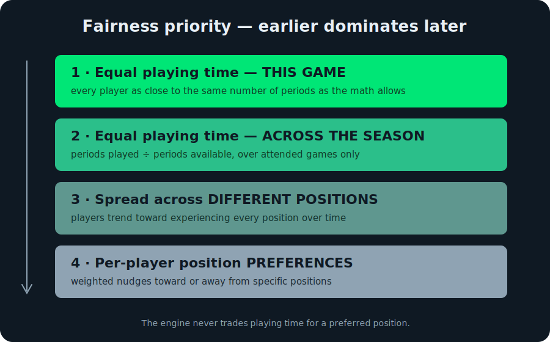

<video controls preload="metadata" width="280">
  <source src="/projects-media/roster-rotation-overview.mp4" type="video/mp4">
  A walkthrough: build a roster, generate a lineup, edit it on the sideline.
</video>

**What it is.** A web app that does one unglamorous job well: it builds a
fair lineup rotation for a youth sports team. Enter a roster, mark who showed
up, pick a format — four quarters, two halves, a single game — and it
produces a period-by-period lineup where every player plays as close to the
same amount as the arithmetic allows. It installs to a phone's home screen,
works with no signal on the sideline, and keeps all its data on the device.
No account, no server, no build step: plain HTML, CSS, and JavaScript served
as a static site, with an additive [Capacitor](https://capacitorjs.com/)
layer that wraps the *same* source into an Android app.

**Why.** "Everyone plays equal time" is the easiest promise a youth coach
can make and the hardest to keep by hand. Kids miss games, some positions
are scarce, and a parent is watching the clock for their kid specifically.
Tracking all of that on a clipboard while also coaching is the actual
problem. The app treats fairness as a scheduling problem with a clean
optimum, and aims to be trustworthy enough to own that bookkeeping.

## Fairness has a strict priority order

The rotation engine balances four goals, and the order *is* the design —
each goal dominates the ones below it, so the engine never trades a player's
playing time for a preferred position.

Season fairness (goal 2) is measured as **periods played ÷ periods
available**, computed only over games a player actually attended. A kid who
shows up to five games is treated exactly like one who shows up to ten —
missing a game neither punishes nor rewards you. This *absence neutrality*
is the single decision that makes the season stats feel fair to parents
rather than arbitrary.

Supports soccer (5v5 through 11v11), basketball, football, hockey, lacrosse,
baseball, or a fully custom position set — across 4 quarters, 3 periods, 2
halves, or 1 undivided game.

## Brute force, on purpose

Each period's position assignment is solved by checking *every* permutation
rather than reaching for the Hungarian algorithm. For a 9-position lineup
that's ~363,000 arrangements, which a phone clears in milliseconds; even an
11-a-side football lineup stays under a second. The payoff is code you can
read top to bottom and an answer that is provably optimal — with zero
matrix-library dependencies.

## The lineup is a live document

After generating, the coach works the **Lineup** tab on the sideline:

- **Tap two players** in the same period to swap them — instantly, or with a
  time-fraction picker / exact stepper.
- **Edit mid-game** to add a late arrival or remove a player (injury,
  departure), with the rest of the game **rebalancing automatically**.
- **Rebalance from any point forward** with a per-period button to
  re-optimize the remainder.
- **Track goals** per player and per opponent period, with a running score
  bar, game labels, and notes.
- Position-colored timeline bars show each player's time at each position;
  tap a bar for a full-game breakdown. Mark a game "Scrimmage" to exclude it
  from season stats.

Every edit saves immediately, so the season stats reflect what actually
happened on the field, not what was planned.

## Season stats

The **Season** tab has three views:

- **Overview** — games played, W-L-D record, roster size, average
  availability, goals for/against with differential, shutouts, and a
  playing-time chart.
- **Games** — an availability dot-chart with W/L/D letters and fairness
  coloring, plus game history with scores and fairness badges.
- **Players** — a per-player stats table, position distribution, and a
  goals chart.

## Game-day constraints

Optional controls before generating a lineup: position pins (lock a player
to a position), position stickiness (reduce changes between periods), a max
periods-per-player cap, a per-position cap, and a max-subs-per-break limit
(useful for large rosters). Defaults are configurable in Settings.

## One field engine, several sports

A separate **Field** tab draws a to-scale pitch / court / rink / diamond as
SVG, with draggable position dots, freehand route and zone drawing, a
defensive overlay, and saved plays. It works standalone or synced with a
game plan. Crucially, formations are **visual only** — they move dots around
the field but never touch the rotation engine, so changing your shape can
never break the fairness math or invalidate a stat.

## One codebase, two distribution channels

The PWA is the default target and ships to GitHub Pages untouched. A thin
Capacitor wrap mirrors the same JS into an Android project for the Play
Store — including a small native bridge for printing a lineup and the system
share sheet for backups — without forking the source or adding a framework.

It's built as pure vanilla HTML/CSS/JS: no build step, no dependencies, no
npm; files load via `<script>` tags and a service worker caches everything
for offline use. When a new version is available the app surfaces a banner
and prompts the coach to back up before updating, rather than swapping the
app out from under them.

## Privacy is a design choice, not a gap

All data lives in the device's local storage. Nothing is sent to any
server, there is no account, and exported backups are local files you share
deliberately. Fonts are self-hosted, so the app makes no third-party or
runtime network calls — which is what lets it honestly disclose, to the Play
Store and to parents, that it collects nothing.

## Where it stops

The engine optimizes *fairness*, not *winning* — it has no notion of
matchups, momentum, or specializing your best players late in a close game.
A positional-play / specialization mode for competitive teams is documented
but deliberately not built. The Capacitor wrap is Android-only today (iOS is
plausible but not done), and full keyboard accessibility for list items is a
tracked gap. Knowing which problems it deliberately doesn't solve is half of
what makes the one it does solve dependable.

---

*Live and installable at
[greenwoodms06.github.io/roster-rotation](https://greenwoodms06.github.io/roster-rotation/).
The build story — the hard-vs-soft fairness-layer separation that keeps the
output trustworthy — is in the post
[Roster Rotation: fair playing time, offline](/blog/roster-rotation).*
