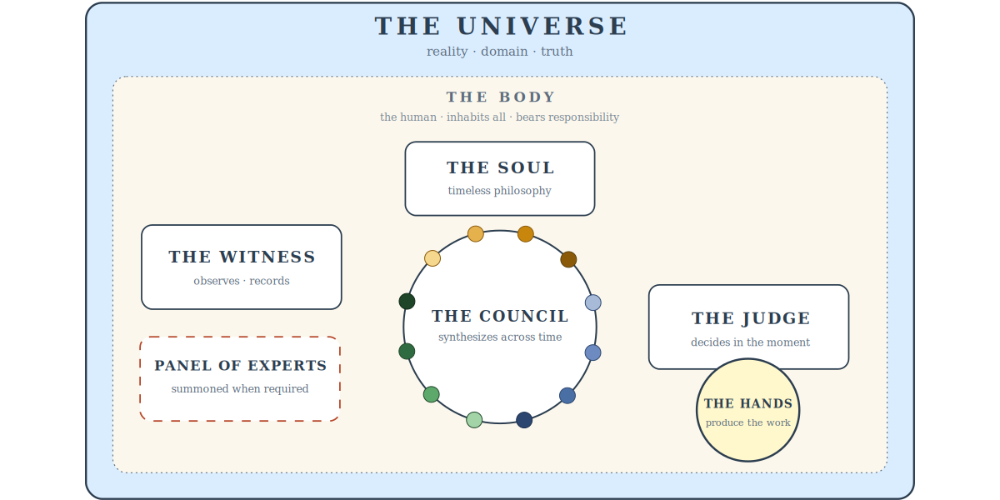

**What it is.** The Soul System is a living philosophy and operational framework
for human–AI collaborative work — research, engineering, science, code. Not a
prompt pack, not a workflow template. A *craft tradition*: a small set of
principles, forged from real failure patterns, that make AI-assisted work more
principled and self-correcting.

**Why.** AI coding assistants are fast and confident — and that's exactly the
problem. They reach for a solution before the problem is framed, pass their own
internal checks while being wrong about reality, and quietly drop the thread
between sessions. The Soul System answers one question: what would it take for an
AI to work like a disciplined craftsperson instead of an eager intern?

## The core idea

It models the work as a few collaborating layers. A **Soul** — the governing
philosophy, never overridden by urgency. A **Witness** that records what actually
happened. A **Council** that synthesises patterns over time. A **Judge** that
decides in the moment. And the **Universe** — reality — consulted continuously,
not occasionally. The human is the **Body**: they inhabit all of it and own the
result. The AI is the instrument.

A handful of mandatory gates do most of the heavy lifting:

- **Frame** the problem at two levels — the immediate task and the larger system
  it lives in — before proposing anything.
- **Name the abstraction** before building the instance.
- **Explain why the current state exists** before changing it (don't tear down a
  fence without knowing why it was built).
- **Consult reality** before calling anything done — internal coherence is not
  enough.

## What makes it different

- **Composes, doesn't replace.** It layers above TDD, BMAD, Cursor rules, your
  own conventions. Adopt what helps; ignore what doesn't.
- **It evolves from its own failures.** Real failure patterns get named —
  *Premature Sophistication*, *Universe Collapse*, *Coherent Falsehood* — recorded,
  and folded back into the philosophy as amendments. The version history *is* the
  lessons learned.
- **Almost zero install.** One import line in a project and the philosophy is live
  across every session.

## More to come

This is the overview — the goal and the shape. Future posts will go deep on the
parts that earned their place: the Council of voices and when to actually convene
them, the failure modes that named themselves under real use, the completion gate
that stops "done" from being a quiet lie, and what dogfooding the system on real
projects — this very site included — actually taught.
